# PRD-0034: Matching Review UI

**Version**: 1.0
**Date**: 2025-12-12
**Author**: Claude
**Status**: Draft
**Depends on**: PRD-0033 (Video Matching System)

---

## 1. Executive Summary

YouTube-NAS 비디오 매칭 결과를 검토하고 승인/거부할 수 있는 웹 기반 리뷰 UI를 설계합니다.

### 1.1 Goals

- 매칭 결과를 시각적으로 비교 검토
- 빠른 승인/거부 워크플로우
- 필터링 및 검색으로 효율적인 리뷰
- 매칭 통계 대시보드

### 1.2 Tech Stack

| Layer | Technology |
|-------|------------|
| Frontend | React + TypeScript |
| UI Framework | Tailwind CSS + shadcn/ui |
| State | Zustand |
| Backend | FastAPI (Python) |
| Database | SQLite (기존 DB 활용) |

---

## 2. System Architecture

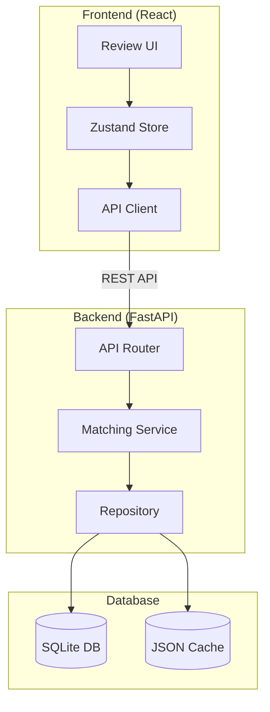

---

## 3. Data Model

### 3.1 Entity Relationship Diagram

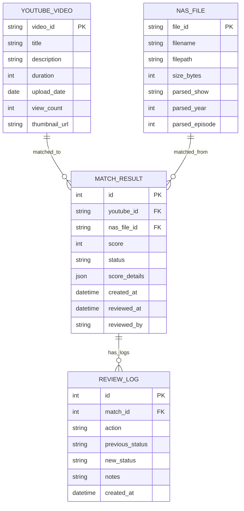

### 3.2 Match Status State Machine

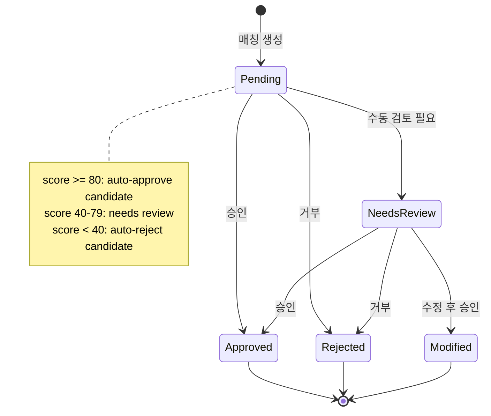

---

## 4. Screen Design

### 4.1 Screen Flow

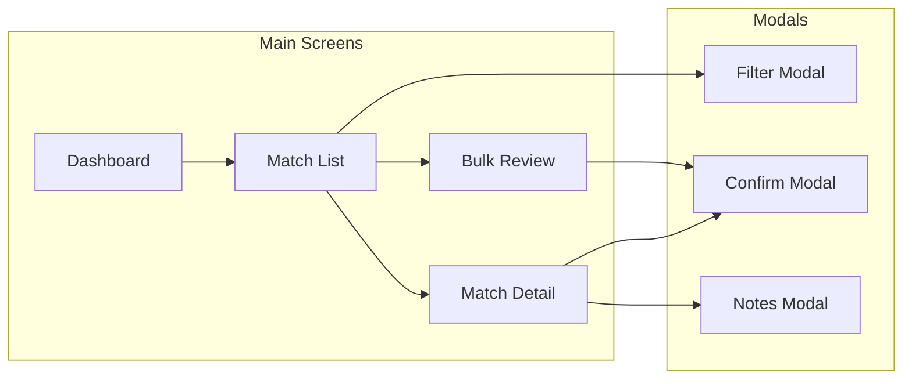

### 4.2 Dashboard Layout

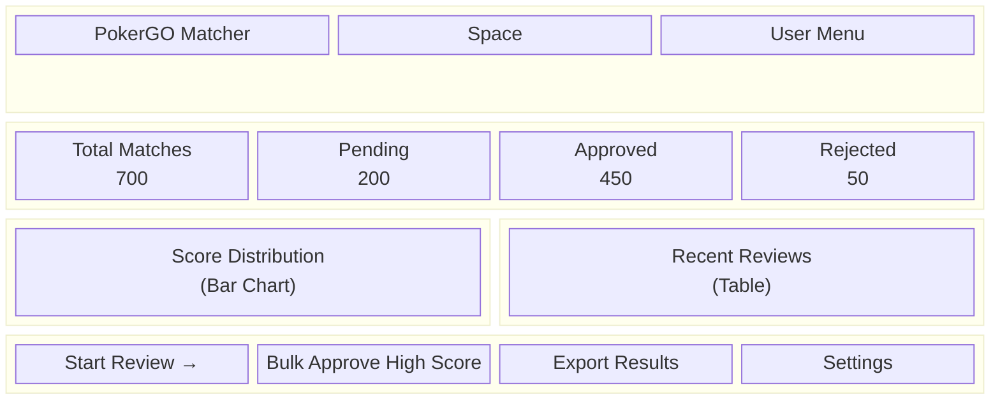

### 4.3 Match List View

```
┌─────────────────────────────────────────────────────────────────────────┐
│  [Search...........................] [Filter ▼] [Sort: Score ▼] [Bulk] │
├─────────────────────────────────────────────────────────────────────────┤
│  ┌─────────────────────────────────────────────────────────────────┐   │
│  │ [85] Phil Ivey DESTROYS at WSOP 2024...                         │   │
│  │      ↔ 16-wsop-2024-be-ev-29-2-7TD-Ivey-Vs-Wong.mp4             │   │
│  │      Year ✓ | Player ✓ | Event ✓ | Game ✓                       │   │
│  │      [Approve] [Reject] [Details →]                    PENDING  │   │
│  └─────────────────────────────────────────────────────────────────┘   │
│  ┌─────────────────────────────────────────────────────────────────┐   │
│  │ [72] Negreanu Hits Straight Flush...                            │   │
│  │      ↔ 33-wsop-2024-be-ev-58-negreanu-hits-straight.mp4         │   │
│  │      Year ✓ | Player ✓ | Event ✓ | Game ✗                       │   │
│  │      [Approve] [Reject] [Details →]                    PENDING  │   │
│  └─────────────────────────────────────────────────────────────────┘   │
│                                                                         │
│  [← Prev]  Page 1 of 35  [Next →]                                      │
└─────────────────────────────────────────────────────────────────────────┘
```

### 4.4 Match Detail View

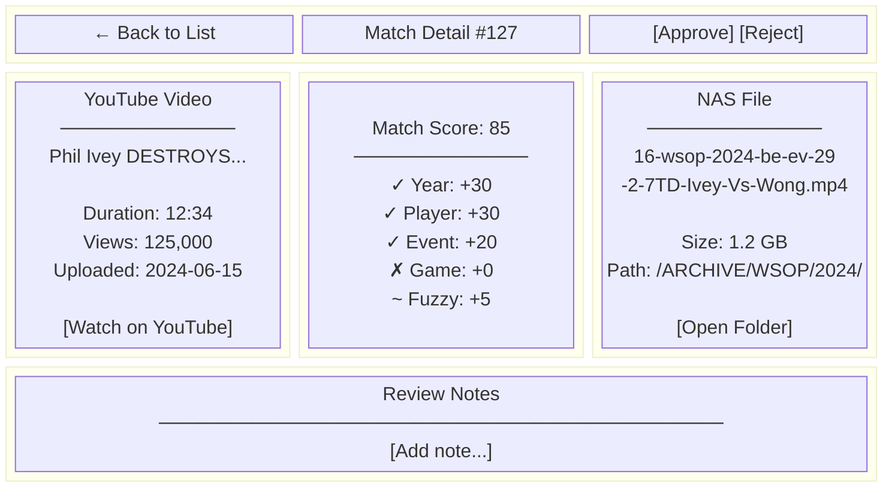

---

## 5. User Flows

### 5.1 Single Review Flow

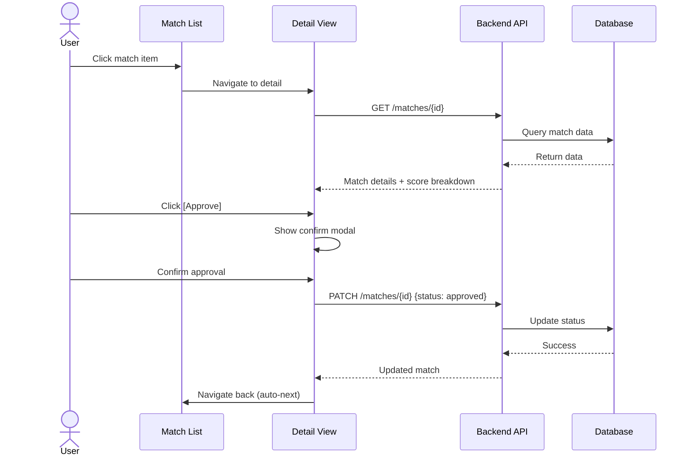

### 5.2 Bulk Review Flow

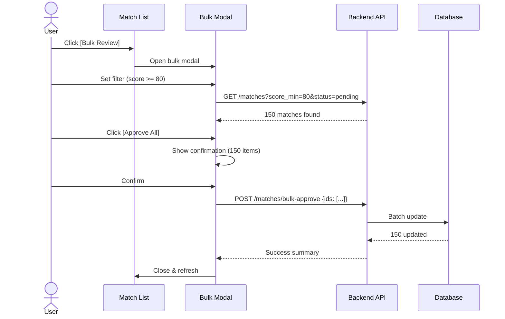

---

## 6. Component Hierarchy

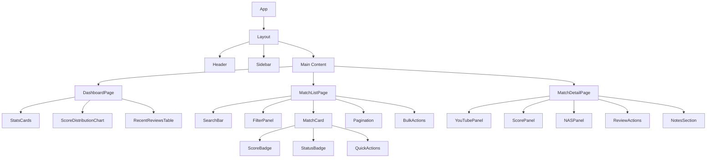

---

## 7. API Endpoints

### 7.1 API Structure

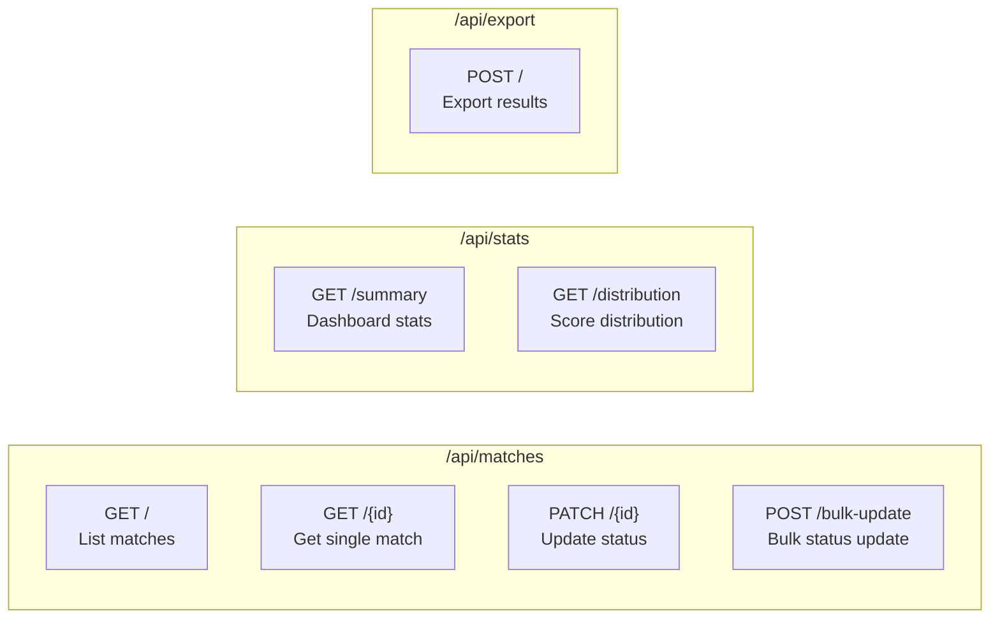

### 7.2 API Specifications

| Endpoint | Method | Description | Parameters |
|----------|--------|-------------|------------|
| `/api/matches` | GET | List matches | `page`, `limit`, `status`, `score_min`, `score_max`, `search` |
| `/api/matches/{id}` | GET | Get match detail | - |
| `/api/matches/{id}` | PATCH | Update match | `status`, `notes` |
| `/api/matches/bulk-update` | POST | Bulk update | `ids[]`, `status` |
| `/api/stats/summary` | GET | Dashboard stats | - |
| `/api/stats/distribution` | GET | Score histogram | `bins` |
| `/api/export` | POST | Export to JSON/CSV | `format`, `status_filter` |

---

## 8. Filter & Search

### 8.1 Filter Options

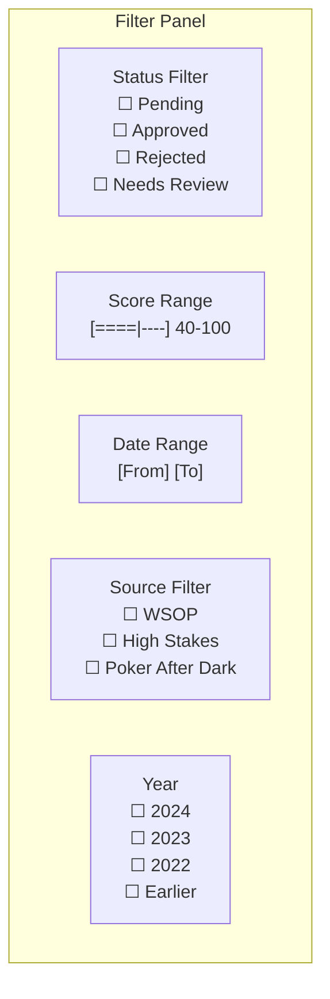

### 8.2 Search Behavior

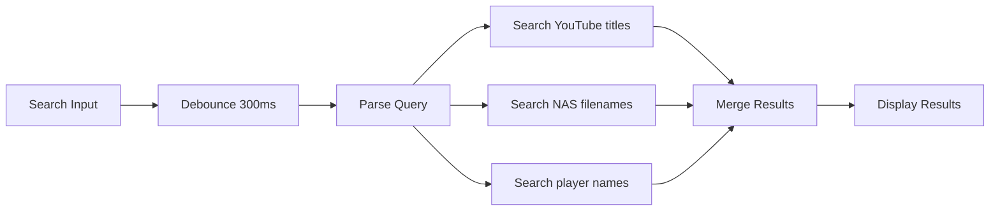

---

## 9. Keyboard Shortcuts

| Key | Action | Context |
|-----|--------|---------|
| `j` / `↓` | Next item | List view |
| `k` / `↑` | Previous item | List view |
| `Enter` | Open detail | List view |
| `a` | Approve | Detail view |
| `r` | Reject | Detail view |
| `Esc` | Back / Close modal | All |
| `/` | Focus search | All |
| `?` | Show shortcuts | All |

---

## 10. Implementation Plan

### 10.1 Phase Breakdown

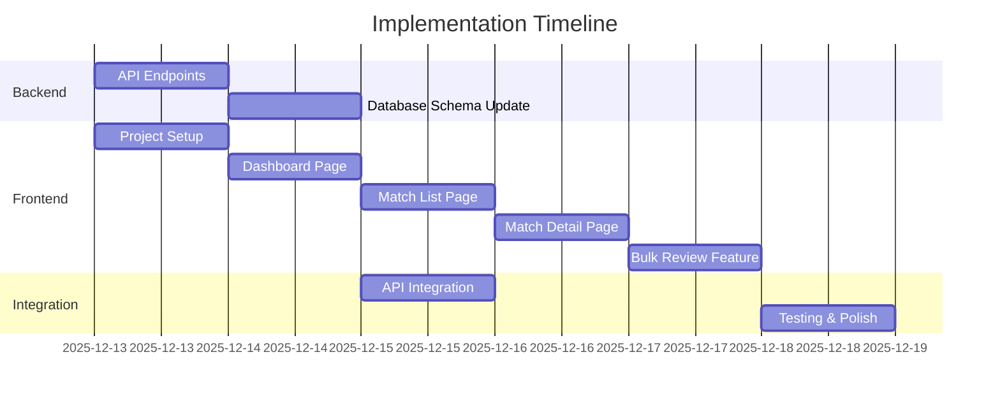

### 10.2 Directory Structure

```
src/
├── api/                          # FastAPI Backend
│   ├── main.py
│   ├── routers/
│   │   ├── matches.py
│   │   └── stats.py
│   └── schemas/
│       └── match.py
│
└── ui/                           # React Frontend
    ├── src/
    │   ├── components/
    │   │   ├── layout/
    │   │   ├── match/
    │   │   └── common/
    │   ├── pages/
    │   │   ├── Dashboard.tsx
    │   │   ├── MatchList.tsx
    │   │   └── MatchDetail.tsx
    │   ├── stores/
    │   │   └── matchStore.ts
    │   ├── api/
    │   │   └── matchApi.ts
    │   └── App.tsx
    ├── package.json
    └── vite.config.ts
```

---

## 11. Success Criteria

- [ ] Dashboard loads in < 1 second
- [ ] List pagination smooth (< 200ms per page)
- [ ] Single review: < 3 clicks to approve/reject
- [ ] Bulk review: process 100+ items in single action
- [ ] Keyboard-first workflow supported
- [ ] Mobile-responsive design

---

## 12. Future Enhancements

1. **Video Preview**: YouTube 영상 인라인 미리보기
2. **NAS Thumbnail**: 비디오 파일 썸네일 생성
3. **AI Suggestions**: 낮은 점수 매칭에 대한 AI 추천
4. **Undo/Redo**: 리뷰 작업 되돌리기
5. **Collaboration**: 다중 리뷰어 지원

---

## 13. References

- PRD-0033: Video Matching System
- shadcn/ui: https://ui.shadcn.com/
- Zustand: https://zustand-demo.pmnd.rs/
