# PRD-0035: Matching Result Viewer UI

**Version**: 1.0
**Date**: 2025-12-12
**Author**: Claude
**Status**: Draft
**Depends on**: PRD-0033 (Video Matching System), PRD-0034 (Matching Review UI)

---

## 1. Executive Summary

NAS Full Episode → YouTube 매칭 결과(742개)를 확인하고 관리하는 웹 UI입니다.
**핵심 목표**: 미업로드 콘텐츠(75개)를 식별하고, 매칭 결과를 검증하며, 수동 매칭을 지원합니다.

### 1.1 현재 매칭 결과

| 상태 | 개수 | 비율 | 설명 |
|------|------|------|------|
| **MATCHED** | 96 | 12.9% | 확실한 매칭 (score ≥ 80) |
| **LIKELY** | 532 | 71.7% | 유력 매칭 (60-79) |
| **POSSIBLE** | 39 | 5.3% | 검토 필요 (40-59) |
| **NOT_UPLOADED** | 75 | 10.1% | 미업로드 추정 (< 40) |

### 1.2 주요 기능

1. **대시보드**: 매칭 현황 통계
2. **매칭 비교 뷰**: YouTube ↔ NAS 직관적 Side-by-Side 비교
3. **매칭 목록**: 상태별 필터링 및 검색
4. **미업로드 관리**: 콘텐츠 업로드 계획 수립
5. **수동 매칭**: 자동 매칭 실패 시 수동 연결
6. **내보내기**: 보고서 생성

---

## 2. System Architecture

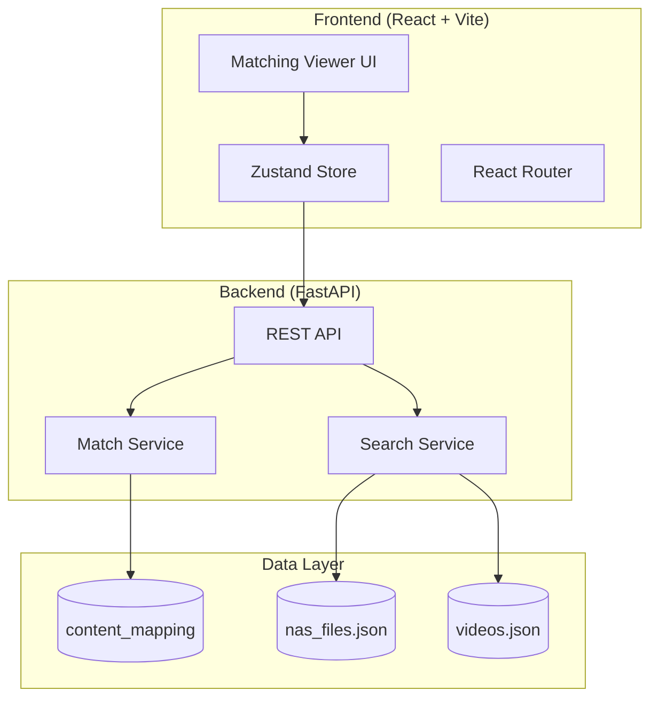

---

## 3. Data Model

### 3.1 content_mapping 테이블 (기존)

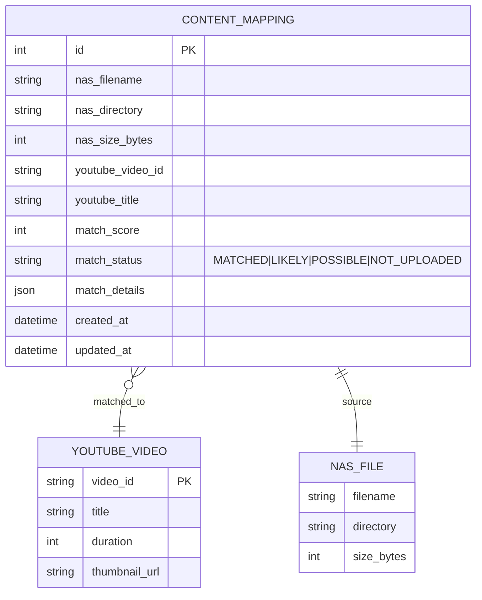

### 3.2 Match Status Flow

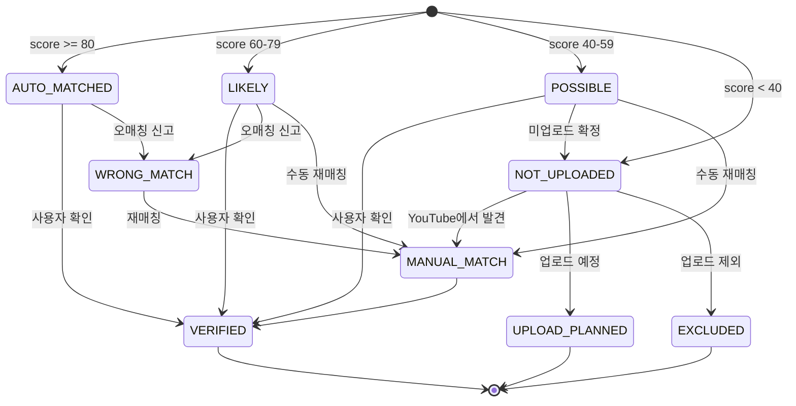

---

## 4. 매칭 비교 핵심 UI (Side-by-Side Comparison)

YouTube와 NAS 파일 간의 매칭을 **직관적으로 비교**하는 것이 이 시스템의 핵심입니다.

### 4.1 비교 UI 컨셉

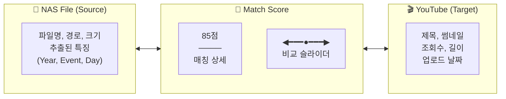

### 4.2 Split View 비교 레이아웃

```
┌──────────────────────────────────────────────────────────────────────────────┐
│  Match Comparison View                                    Score: 85/100 🟢    │
├────────────────────────────────┬─────────────────────────────────────────────┤
│                                │                                             │
│  📁 NAS FILE                   │  🎬 YOUTUBE VIDEO                           │
│  ════════════════════════════  │  ════════════════════════════════════════   │
│                                │                                             │
│  wsop-2024-me-day4-ft.mp4     │  ┌─────────────────────────────────────┐    │
│                                │  │    [YouTube Thumbnail Preview]     │    │
│  📂 Path:                      │  │                                     │    │
│  ARCHIVE/WSOP/2024/Main Event/ │  │         ▶ 2:34:15                   │    │
│                                │  └─────────────────────────────────────┘    │
│  📊 Extracted Features:        │                                             │
│  ┌──────────────────────────┐  │  Title:                                     │
│  │ Year:    2024       ✅   │  │  2024 WSOP Main Event Day 4 - Final Table  │
│  │ Event:   WSOP       ✅   │  │                                             │
│  │ Day:     4          ✅   │  │  👁 125,432 views                           │
│  │ Type:    Main Event ✅   │  │  📅 Uploaded: 2024-07-20                    │
│  │ Episode: -          ⬜   │  │  ⏱ Duration: 2:34:15                        │
│  └──────────────────────────┘  │                                             │
│                                │  📊 Extracted Features:                     │
│  💾 Size: 2.4 GB               │  ┌───────────────────────────────────────┐  │
│  🎞 Format: MP4                │  │ Year:    2024       ✅ MATCH          │  │
│                                │  │ Event:   WSOP       ✅ MATCH          │  │
│                                │  │ Day:     4          ✅ MATCH          │  │
│                                │  │ Type:    Main Event ✅ MATCH          │  │
│                                │  │ Episode: -          ⬜ N/A            │  │
│                                │  └───────────────────────────────────────┘  │
│                                │                                             │
├────────────────────────────────┴─────────────────────────────────────────────┤
│                                                                              │
│  🔍 MATCH SCORE BREAKDOWN                                                    │
│  ━━━━━━━━━━━━━━━━━━━━━━━━━━━━━━━━━━━━━━━━━━━━━━━━━━━━━━━━━━━━━━━━━━━━━━━━━   │
│                                                                              │
│  ┌─────────────┐ ┌─────────────┐ ┌─────────────┐ ┌─────────────┐            │
│  │ Year Match  │ │ Event Match │ │ Day Match   │ │ SBERT Score │            │
│  │    +30      │ │    +25      │ │    +15      │ │    +15      │            │
│  │  ███████████│ │  ███████████│ │  ███████████│ │  ██████████ │            │
│  │   (2024)    │ │   (WSOP)    │ │   (Day 4)   │ │  (sim:0.82) │            │
│  └─────────────┘ └─────────────┘ └─────────────┘ └─────────────┘            │
│                                                                              │
│                          Total Score: 85/100                                 │
│                                                                              │
├──────────────────────────────────────────────────────────────────────────────┤
│  [✓ Confirm Match]  [✗ Wrong Match]  [🔗 Re-match]  [▶ Watch on YouTube]    │
└──────────────────────────────────────────────────────────────────────────────┘
```

### 4.3 Feature Matching Visualization

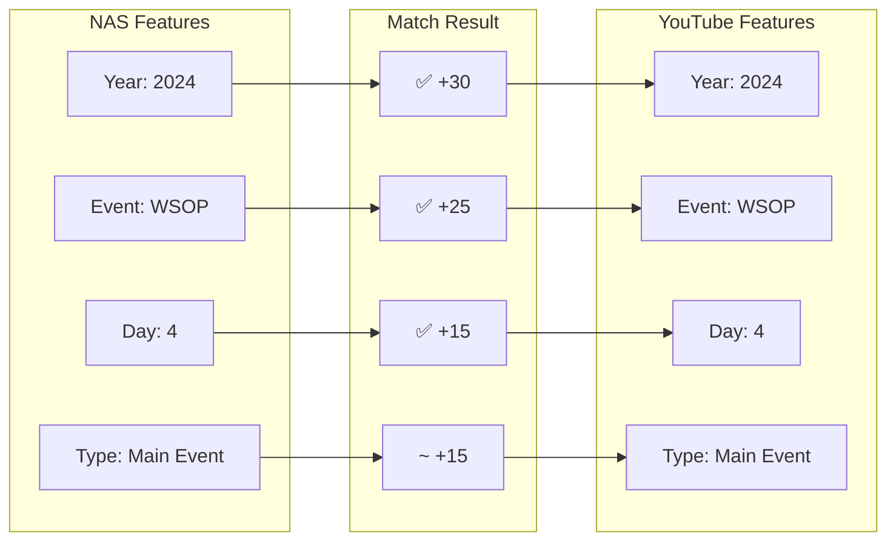

### 4.4 비교 슬라이더 (Before/After Style)

이미지 비교 슬라이더 방식을 응용하여 NAS와 YouTube 정보를 동적으로 비교합니다.

```
┌──────────────────────────────────────────────────────────────────────┐
│                                                                      │
│  ◀────────────────────●──────────────────────▶                       │
│                       ↑                                              │
│                   Drag to Compare                                    │
│                                                                      │
│  ┌──────────────────────┬───────────────────────────────────────┐   │
│  │                      │                                       │   │
│  │  📁 NAS              │  🎬 YouTube                           │   │
│  │                      │                                       │   │
│  │  wsop-2024-me-       │  2024 WSOP Main Event                 │   │
│  │  day4-ft.mp4         │  Day 4 - Final Table                  │   │
│  │                      │                                       │   │
│  │  Year: 2024          │  Year: 2024                           │   │
│  │  Event: WSOP     ◀───┼───▶ Event: WSOP                       │   │
│  │  Day: 4              │  Day: 4                               │   │
│  │                      │                                       │   │
│  └──────────────────────┴───────────────────────────────────────┘   │
│                                                                      │
└──────────────────────────────────────────────────────────────────────┘
```

### 4.5 Heat Map 스타일 매칭 점수

```
┌─────────────────────────────────────────────────────────────────────┐
│  Match Confidence Heat Map                                          │
├─────────────────────────────────────────────────────────────────────┤
│                                                                     │
│  Feature        NAS Value        YouTube Value     Score            │
│  ─────────────────────────────────────────────────────────────      │
│  Year           2024             2024              ████████████ 30  │
│  Event          WSOP             WSOP              ██████████   25  │
│  Day            4                4                 ██████       15  │
│  Episode        -                -                 ░░░░░░        0  │
│  Semantic       -                -                 ██████       15  │
│  ─────────────────────────────────────────────────────────────      │
│  TOTAL                                             ████████████ 85  │
│                                                                     │
│  🟢 MATCHED (High Confidence)                                       │
└─────────────────────────────────────────────────────────────────────┘
```

### 4.6 Butterfly Chart (좌우 대칭 비교)

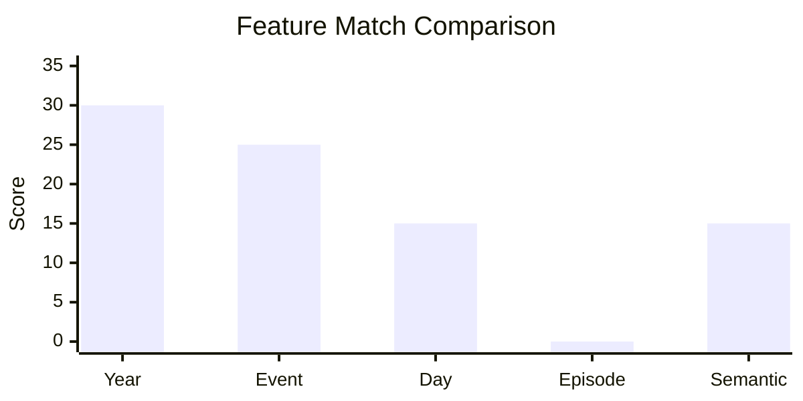

### 4.7 Quick Compare Cards (리스트 뷰)

```
┌─────────────────────────────────────────────────────────────────────────────┐
│  Quick Compare: 742 Matches                      [Grid View] [List View]    │
├─────────────────────────────────────────────────────────────────────────────┤
│                                                                             │
│  ┌───────────────────────────────────────────────────────────────────────┐  │
│  │ 🟢 85   📁 wsop-2024-me-day4.mp4  ━━━━━━━━▶  🎬 2024 WSOP ME Day 4   │  │
│  │         Year ✅ Event ✅ Day ✅ Semantic ✅                            │  │
│  └───────────────────────────────────────────────────────────────────────┘  │
│                                                                             │
│  ┌───────────────────────────────────────────────────────────────────────┐  │
│  │ 🟡 68   📁 WSOPE08_Ep3.mov        ━━━━━━━━▶  🎬 WSOP Europe 2008 Ep3 │  │
│  │         Year ✅ Event ✅ Episode ✅ Semantic ⚠️                        │  │
│  └───────────────────────────────────────────────────────────────────────┘  │
│                                                                             │
│  ┌───────────────────────────────────────────────────────────────────────┐  │
│  │ 🔴 12   📁 2025-wsope-plo.mp4     ━━━ ✗ ━━▶  🎬 (No Match Found)     │  │
│  │         Year ❌ Event ⚠️ Day ❌ Semantic ❌                            │  │
│  └───────────────────────────────────────────────────────────────────────┘  │
│                                                                             │
└─────────────────────────────────────────────────────────────────────────────┘
```

### 4.8 추천 React 컴포넌트

| 용도 | 컴포넌트 | 설명 |
|------|----------|------|
| Split View | `react-split-pane` | 드래그로 크기 조절 가능한 2분할 |
| Before/After Slider | `react-comparison-slider` | 키보드 접근 가능한 비교 슬라이더 |
| Diff View | `react-diff-viewer` | GitHub 스타일 차이 비교 |
| Heat Map | `recharts` HeatMapGrid | 점수 시각화 |
| 애니메이션 | `framer-motion` | 부드러운 전환 효과 |

---

## 5. Screen Design

### 5.1 전체 화면 구조

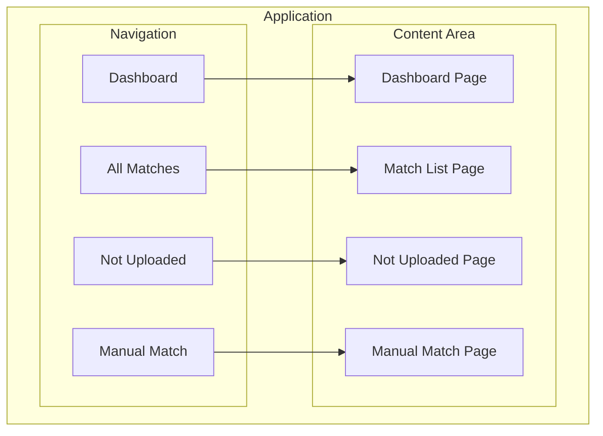

### 4.2 Dashboard 레이아웃

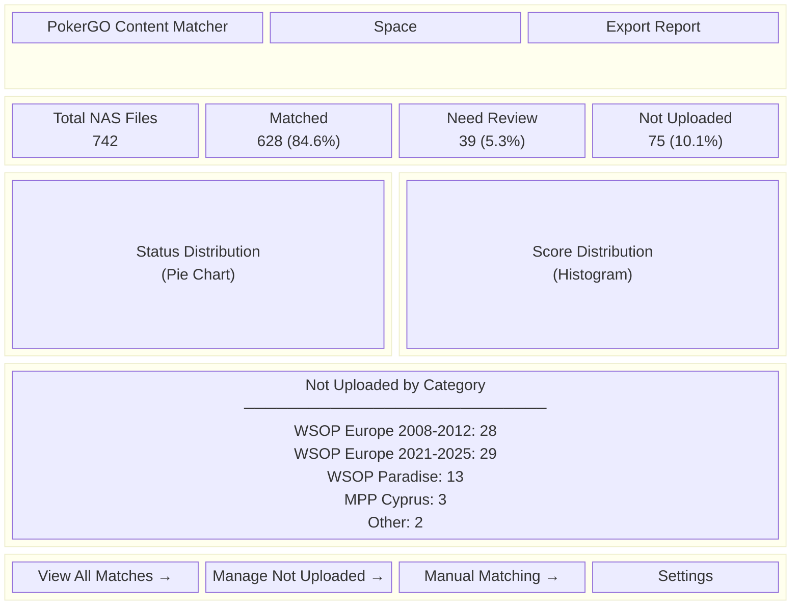

### 4.3 Match List View

```
┌─────────────────────────────────────────────────────────────────────────────┐
│  PokerGO Content Matcher                    [Dashboard] [Matches] [Not Up]  │
├─────────────────────────────────────────────────────────────────────────────┤
│                                                                             │
│  [🔍 Search NAS filename or YouTube title...]                               │
│                                                                             │
│  Status: [All ▼]  Score: [0-100 ▼]  Year: [All ▼]  Event: [All ▼]          │
│                                                                             │
├─────────────────────────────────────────────────────────────────────────────┤
│                                                                             │
│  ┌─────────────────────────────────────────────────────────────────────┐   │
│  │ 🟢 MATCHED [85]                                                      │   │
│  │                                                                       │   │
│  │ NAS:  wsop-2024-me-day4-final-table.mp4                              │   │
│  │       📁 ARCHIVE/WSOP/2024 WSOP/Main Event/                          │   │
│  │                                                                       │   │
│  │ YouTube: 2024 WSOP Main Event Day 4 - Final Table                    │   │
│  │          🎬 2:34:15 | 👁 125,432 views                                │   │
│  │                                                                       │   │
│  │ Match: year +30 | event +25 | day +15 | sbert +15                    │   │
│  │                                                                       │   │
│  │                              [✓ Verify] [✗ Wrong] [📄 Details]       │   │
│  └─────────────────────────────────────────────────────────────────────┘   │
│                                                                             │
│  ┌─────────────────────────────────────────────────────────────────────┐   │
│  │ 🟡 LIKELY [68]                                                       │   │
│  │                                                                       │   │
│  │ NAS:  WSOPE08_Episode_3_H264.mov                                     │   │
│  │       📁 ARCHIVE/WSOP Europe/2008/                                   │   │
│  │                                                                       │   │
│  │ YouTube: WSOP Europe 2008 - Episode 3 | Main Event Day 2             │   │
│  │          🎬 45:20 | 👁 45,231 views                                   │   │
│  │                                                                       │   │
│  │ Match: year +30 | event +25 | episode +10 | sbert +3                 │   │
│  │                                                                       │   │
│  │                              [✓ Verify] [✗ Wrong] [📄 Details]       │   │
│  └─────────────────────────────────────────────────────────────────────┘   │
│                                                                             │
│  ┌─────────────────────────────────────────────────────────────────────┐   │
│  │ 🔴 NOT_UPLOADED [12]                                                 │   │
│  │                                                                       │   │
│  │ NAS:  2025 WSOPE #10 10,000 Pot-Limit Omaha Mystery Bounty.mp4      │   │
│  │       📁 ARCHIVE/WSOP Europe/2025/                                   │   │
│  │                                                                       │   │
│  │ Best Match: WSOP Europe 2024 - PLO High Roller (score: 38)           │   │
│  │                                                                       │   │
│  │                              [🔗 Find Match] [📅 Plan Upload]        │   │
│  └─────────────────────────────────────────────────────────────────────┘   │
│                                                                             │
│  [← Prev]  Page 1 of 75  [Next →]                    Showing 1-10 of 742   │
└─────────────────────────────────────────────────────────────────────────────┘
```

### 4.4 Not Uploaded Management

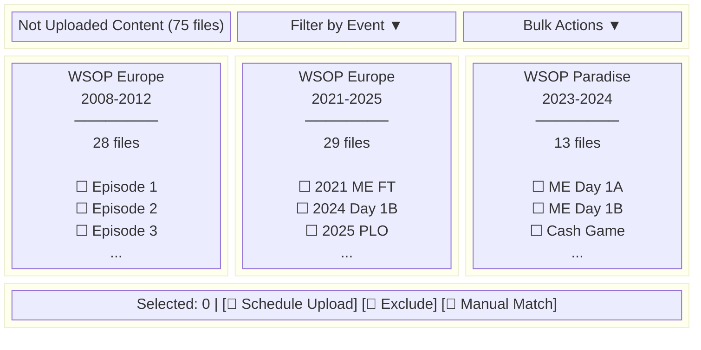

### 4.5 Manual Match Modal

```
┌───────────────────────────────────────────────────────────────────────┐
│  Manual Match                                                    [X]  │
├───────────────────────────────────────────────────────────────────────┤
│                                                                       │
│  NAS File:                                                            │
│  ┌─────────────────────────────────────────────────────────────────┐  │
│  │ 📁 WSOPE08_Episode_1_H264.mov                                   │  │
│  │    ARCHIVE/WSOP Europe/2008/                                    │  │
│  │    Size: 1.2 GB                                                 │  │
│  └─────────────────────────────────────────────────────────────────┘  │
│                                                                       │
│  Search YouTube:                                                      │
│  [🔍 wsop europe 2008 episode 1...........................]           │
│                                                                       │
│  Search Results:                                                      │
│  ┌─────────────────────────────────────────────────────────────────┐  │
│  │ ○ WSOP Europe 2008 - Episode 1 | Opening Day                   │  │
│  │   🎬 52:30 | 👁 23,456 views | Similarity: 72%                  │  │
│  ├─────────────────────────────────────────────────────────────────┤  │
│  │ ○ WSOP Europe 2008 Main Event Highlights                       │  │
│  │   🎬 15:20 | 👁 89,123 views | Similarity: 45%                  │  │
│  ├─────────────────────────────────────────────────────────────────┤  │
│  │ ○ Best of WSOP Europe 2008                                     │  │
│  │   🎬 28:45 | 👁 156,789 views | Similarity: 38%                 │  │
│  └─────────────────────────────────────────────────────────────────┘  │
│                                                                       │
│  ○ Mark as "Not on YouTube" (confirm not uploaded)                   │
│                                                                       │
│                              [Cancel]  [Confirm Match]                │
└───────────────────────────────────────────────────────────────────────┘
```

### 4.6 Match Detail View

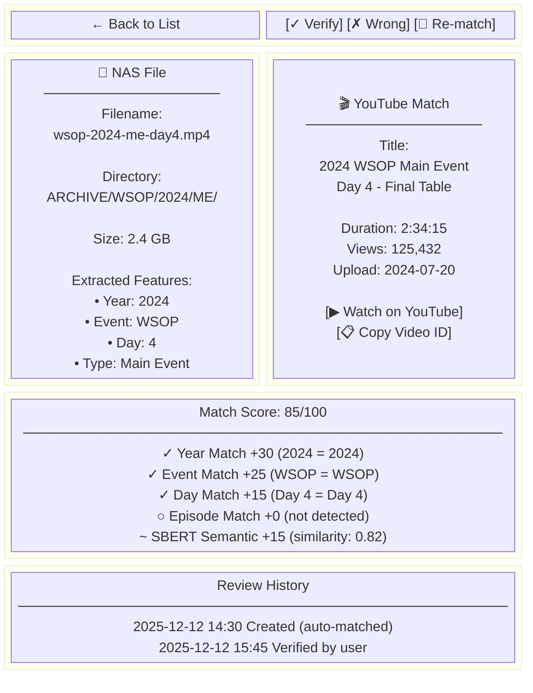

---

## 5. User Flows

### 5.1 Dashboard Overview Flow

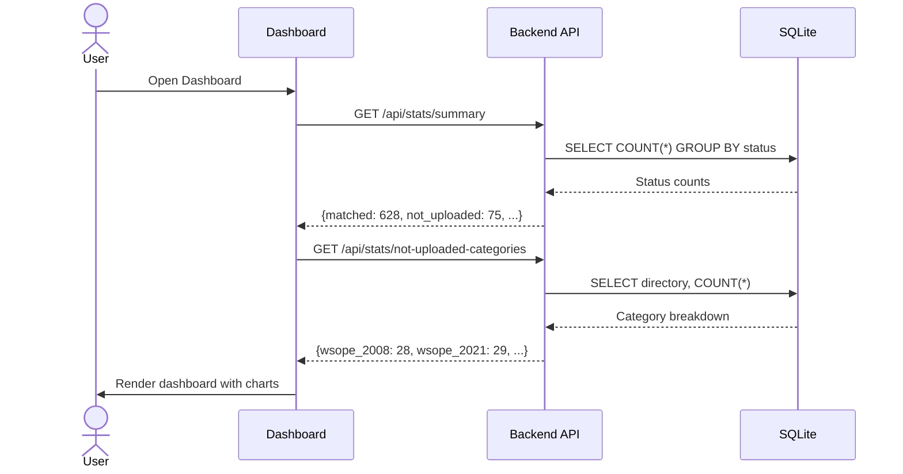

### 5.2 Verify Match Flow

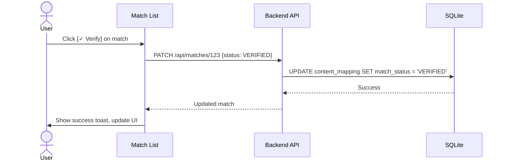

### 5.3 Manual Match Flow

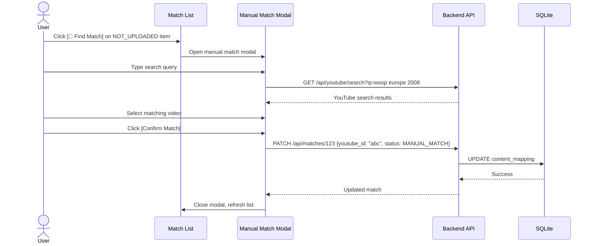

### 5.4 Bulk Action Flow

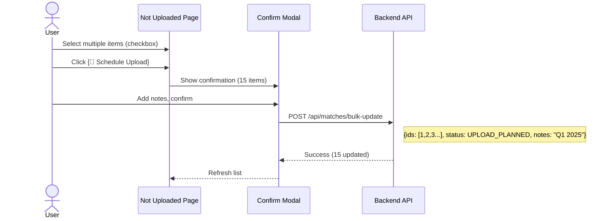

---

## 6. Component Hierarchy

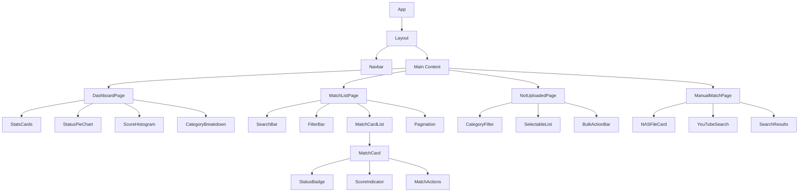

---

## 7. API Endpoints

### 7.1 API Overview

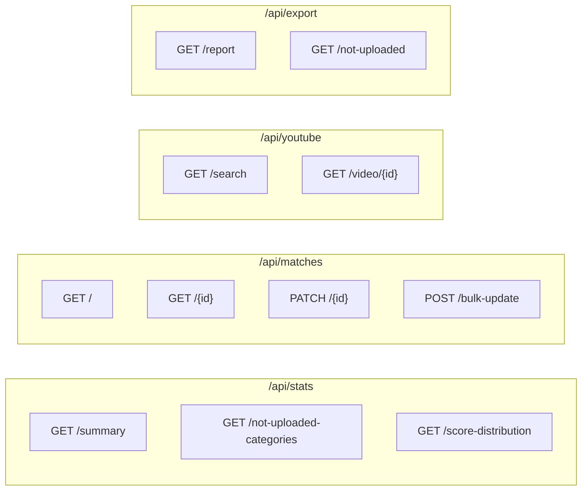

### 7.2 API Specifications

| Endpoint | Method | Description | Parameters |
|----------|--------|-------------|------------|
| `/api/stats/summary` | GET | 대시보드 통계 | - |
| `/api/stats/not-uploaded-categories` | GET | 미업로드 카테고리별 집계 | - |
| `/api/stats/score-distribution` | GET | 점수 분포 히스토그램 | `bins=10` |
| `/api/matches` | GET | 매칭 목록 | `status`, `score_min`, `score_max`, `year`, `event`, `page`, `limit` |
| `/api/matches/{id}` | GET | 매칭 상세 | - |
| `/api/matches/{id}` | PATCH | 매칭 업데이트 | `status`, `youtube_id`, `notes` |
| `/api/matches/bulk-update` | POST | 일괄 업데이트 | `ids[]`, `status`, `notes` |
| `/api/youtube/search` | GET | YouTube 검색 | `q`, `limit=10` |
| `/api/export/report` | GET | 전체 보고서 | `format=json|csv` |
| `/api/export/not-uploaded` | GET | 미업로드 목록 | `format=json|csv` |

### 7.3 Response Examples

```json
// GET /api/stats/summary
{
  "total": 742,
  "by_status": {
    "MATCHED": 96,
    "LIKELY": 532,
    "POSSIBLE": 39,
    "NOT_UPLOADED": 75
  },
  "match_rate": 84.6,
  "avg_score": 64.8
}

// GET /api/matches?status=NOT_UPLOADED&page=1&limit=10
{
  "items": [
    {
      "id": 1,
      "nas_filename": "WSOPE08_Episode_1_H264.mov",
      "nas_directory": "ARCHIVE/WSOP Europe/2008/",
      "youtube_title": null,
      "youtube_video_id": null,
      "match_score": 10,
      "match_status": "NOT_UPLOADED",
      "best_match": {
        "title": "WSOP Europe 2009 Episode 1",
        "score": 38
      }
    }
  ],
  "total": 75,
  "page": 1,
  "pages": 8
}
```

---

## 8. Filter & Search

### 8.1 Filter Options

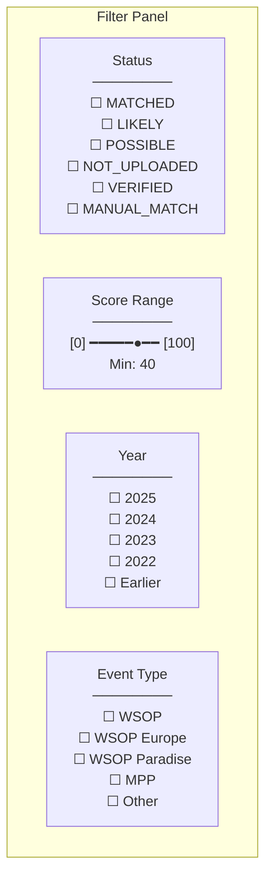

### 8.2 Search Behavior

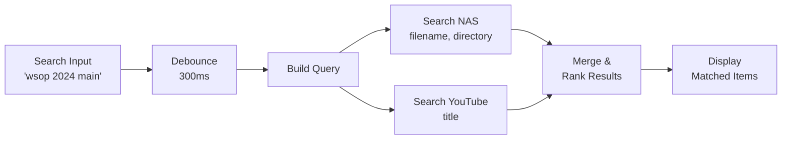

---

## 9. Tech Stack

| Layer | Technology | Rationale |
|-------|------------|-----------|
| Frontend | React 18 + TypeScript | 컴포넌트 기반, 타입 안전성 |
| Build Tool | Vite | 빠른 개발 서버 |
| UI Components | shadcn/ui + Tailwind | 일관된 디자인, 커스터마이징 용이 |
| Charts | Recharts | React 친화적, 가벼움 |
| State | Zustand | 심플한 상태 관리 |
| HTTP Client | TanStack Query | 캐싱, 자동 리페치 |
| Backend | FastAPI | 빠른 API 개발, OpenAPI 문서화 |
| Database | SQLite | 기존 content_mapping 테이블 활용 |

---

## 10. Directory Structure

```
pokergo_crawling/
├── src/
│   ├── api/                          # FastAPI Backend
│   │   ├── main.py                   # FastAPI app
│   │   ├── routers/
│   │   │   ├── stats.py              # /api/stats
│   │   │   ├── matches.py            # /api/matches
│   │   │   ├── youtube.py            # /api/youtube
│   │   │   └── export.py             # /api/export
│   │   ├── services/
│   │   │   ├── match_service.py
│   │   │   └── youtube_service.py
│   │   └── schemas/
│   │       └── match.py
│   │
│   └── ui/                           # React Frontend
│       ├── src/
│       │   ├── components/
│       │   │   ├── layout/
│       │   │   │   ├── Navbar.tsx
│       │   │   │   └── Layout.tsx
│       │   │   ├── dashboard/
│       │   │   │   ├── StatsCards.tsx
│       │   │   │   ├── StatusPieChart.tsx
│       │   │   │   └── CategoryBreakdown.tsx
│       │   │   ├── matches/
│       │   │   │   ├── MatchCard.tsx
│       │   │   │   ├── MatchList.tsx
│       │   │   │   ├── FilterBar.tsx
│       │   │   │   └── ManualMatchModal.tsx
│       │   │   └── common/
│       │   │       ├── StatusBadge.tsx
│       │   │       └── ScoreIndicator.tsx
│       │   ├── pages/
│       │   │   ├── Dashboard.tsx
│       │   │   ├── MatchList.tsx
│       │   │   ├── NotUploaded.tsx
│       │   │   └── ManualMatch.tsx
│       │   ├── stores/
│       │   │   └── matchStore.ts
│       │   ├── api/
│       │   │   └── matchApi.ts
│       │   ├── types/
│       │   │   └── match.ts
│       │   ├── App.tsx
│       │   └── main.tsx
│       ├── package.json
│       ├── vite.config.ts
│       └── tailwind.config.js
│
├── data/
│   ├── db/
│   │   └── pokergo.db               # SQLite (content_mapping)
│   └── analysis/
│       ├── full_episode_matching_all.json
│       └── not_uploaded_content.json
```

---

## 11. Implementation Phases

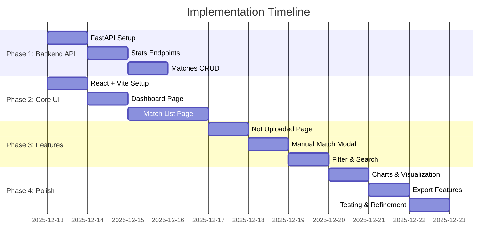

---

## 12. Key Features Summary

### 12.1 Dashboard
- 전체 매칭 현황 카드 (742개 중 628개 매칭)
- 상태별 파이 차트
- 점수 분포 히스토그램
- 미업로드 카테고리별 분류

### 12.2 Match List
- 상태, 점수, 연도, 이벤트별 필터
- NAS 파일명/YouTube 제목 검색
- 빠른 검증(Verify)/오류 신고(Wrong) 버튼
- 매칭 점수 상세 breakdown

### 12.3 Not Uploaded Management
- 카테고리별 그룹핑 (WSOP Europe, Paradise, etc.)
- 체크박스 다중 선택
- 일괄 작업 (업로드 예정, 제외, 수동 매칭)

### 12.4 Manual Match
- NAS 파일 정보 표시
- YouTube 검색 기능
- 유사도 점수와 함께 결과 표시
- "YouTube에 없음" 확정 옵션

---

## 13. Success Criteria

| Metric | Target |
|--------|--------|
| 대시보드 로딩 | < 1초 |
| 목록 페이지네이션 | < 200ms |
| 검색 응답 | < 500ms |
| 일괄 작업 (100건) | < 3초 |
| 검증 작업 클릭 수 | 1 click |

---

## 14. Future Enhancements

1. **YouTube 미리보기**: 영상 인라인 플레이어
2. **NAS 썸네일**: 비디오 파일 미리보기 이미지
3. **AI 추천**: 미매칭 콘텐츠에 대한 AI 기반 YouTube 검색
4. **알림**: 새 콘텐츠 감지 시 알림
5. **히스토리**: 모든 변경 이력 추적

---

## 15. References

- PRD-0033: Video Matching System
- PRD-0034: Matching Review UI (초기 설계)
- 매칭 결과: `data/analysis/full_episode_matching_all.json`
- 미업로드 목록: `data/analysis/not_uploaded_content.json`
